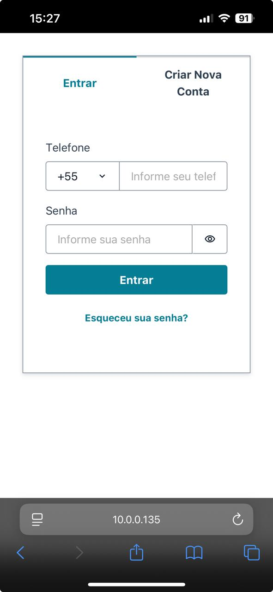
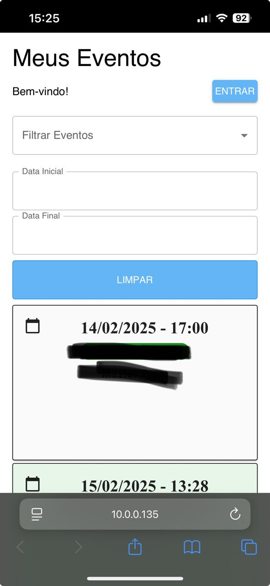
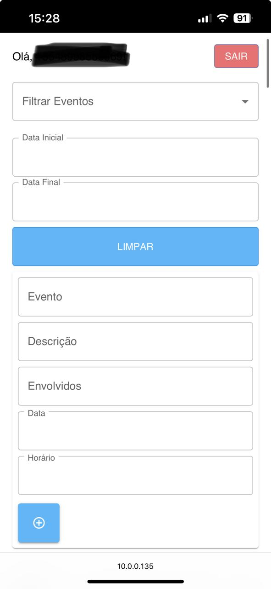
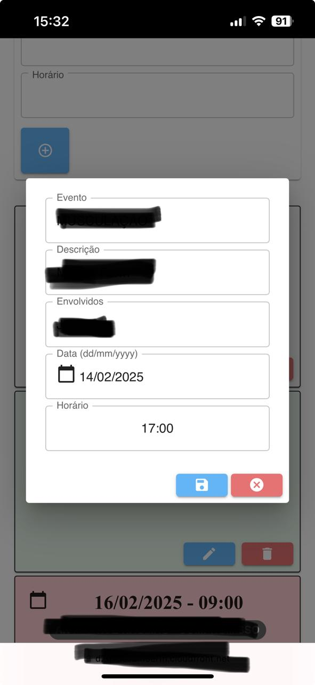

# My Event Sync

My Event Sync is a serverless event scheduling application that uses AWS Amplify for the backend (including AWS Lambda and DynamoDB) and a React frontend built with Material UI. 
The app allows users to create, list, edit, and delete events.

<p align="center">
  
  
  
  
</p>

## Features

- **Event Management:** Create, view, edit, and delete events.
- **Responsive UI:** Built with React and Material UI for an optimal experience on both mobile and desktop devices.
- **Serverless Backend:** AWS Lambda functions perform CRUD operations on a DynamoDB table.
- **Scheduled Cleanup:** A scheduled Lambda (via EventBridge) can automatically remove past events.
- **Highlights:** Automatically highlights events with defined rules for past events, today, tomorrow, the next two days, and subsequent dates.


## Project Structure

The repository is organized into two main parts: the backend managed by AWS Amplify and the frontend built with React.

- **amplify/**: Contains the configuration and deployment artifacts for your AWS backend (Lambda functions, API Gateway, DynamoDB, etc.).
- **amplify.yml**: Located at the root of the repository, this file defines the build and deployment process for the frontend. It instructs Amplify to install dependencies, build the React application, and deploy the resulting static files to S3 with CloudFront.
- **frontend/**: This folder contains your React application, including:
  - **src/**: All the source code (components, pages, etc.).
  - **public/**: Public assets and the main HTML file (index.html).
  - **package.json**: Frontend dependencies and scripts (e.g., `start` and `build`).
  - **build/**: Generated when you run `yarn build`; contains optimized static files for production.
- **package.json (at the root)**: A minimal package file to satisfy Amplify's CLI requirements.

## Requirements

- **Node.js** (v14 or later recommended)
- **Yarn** (preferred package manager)
- An AWS account with Amplify CLI configured
- Amplify CLI installed globally

## Deployment

The deployment process uses AWS Amplify to build and publish the React frontend along with your backend resources.

**Build the Frontend Locally:**

Navigate to the frontend folder and run:

```bash
  cd frontend
  yarn build
```

This generates the production build in the `/frontend/build` directory.

**Prepare the Distribution Folder:**

Navigate to the root folder and run:

```bash
  yarn --cwd frontend build && mkdir -p dist && cp -R frontend/build/. dist/
```

This configuration does the following:

- Installs dependencies in the frontend folder.
- Runs the build command in the frontend folder.
- Creates a dist folder at the root and copies all build artifacts into it.
- Specifies the dist folder as the source for deployment.

**Publish with Amplify:**

From the root of your repository (where the amplify folder is located), run:

```bash
  amplify publish
```

This command builds the project, copies the build output to dist, and deploys the application via S3 and CloudFront.

## Usage

**Adding an Event**

Fill out the form at the top of the page with the event details:

- `Evento`: Name of the event.
- `Local`: Location.
- `Envolvidos`: List of participants.
- `Data`: Select the date (using the native date input).
- `Horário`: Specify the time.

Click `Adicionar Evento` to submit. The event will be sent to the backend and appear in the table.

**Viewing Events**

The events table displays:

- `Data`: Formatted as `dd/mm/yyyy`.
- `Horário`, `Envolvidos`, `Evento`, `Local`: Details of the event.

Events scheduled for the current day are highlighted with a subtle background color.

**Editing an Event**

Click the `Editar` button in an event row. A modal will open with the event details.

Update the fields as needed and click `Salvar` to update the event.

**Deleting an Event**

Click the Remover button in an event row to delete the event.

## Backend Functions

The backend is implemented with AWS Lambda functions (managed via Amplify) that perform the following operations on a DynamoDB table:

- `POST`: Create a new event.
- `GET`: List events, sorted by date and time.
- `PUT`: Edit an existing event.
- `DELETE`: Remove an event.

`Optional`: A scheduled Lambda can remove events older than the current day.

## Troubleshooting

**CloudFront Cache:**

If updates are not visible, try invalidating the CloudFront cache.

**Amplify Deployment:**

If the deployment doesn't update, verify your amplify.yml configuration and check the Amplify Console logs.

## Contact
For questions or suggestions, please open an issue on the repository.
